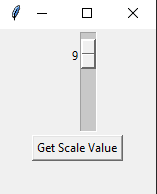
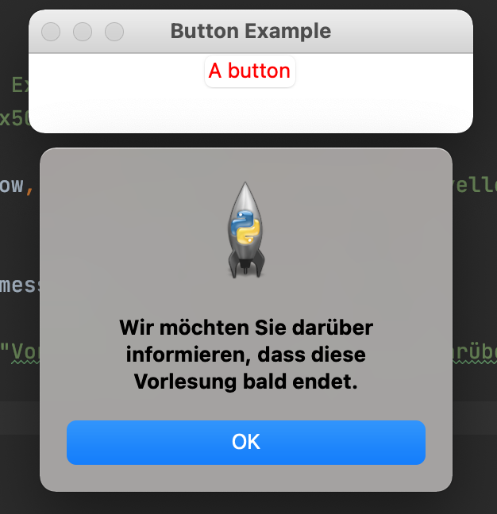
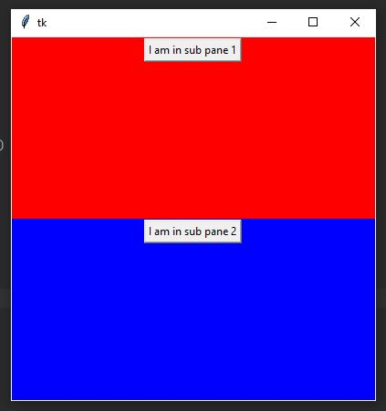

# Tkinter Examples and Screenshots

## Tkinter Button

### Source code example

```python
import tkinter as tk

window = tk.Tk()
window.title("Button Example")
window.geometry("280x50")

btn = tk.Button(window, text="A button", fg="red", bg="yellow")
btn.pack()

window.mainloop()

```

### Screenshot


## Tkinter Menu and Menubutton

### Source code example
```python
import tkinter as tk

window = tk.Tk()
window.title("Menu Example")
window.geometry("280x50")

lab = tk.Label(window, text ='Menu', font = "50")

lab.pack()

menubutton = tk.Menubutton(window, text="Gruppe 1")

menubutton.menu = tk.Menu(menubutton)
menubutton["menu"] = menubutton.menu

var1 = tk.IntVar()
var2 = tk.IntVar()
var3 = tk.IntVar()

menubutton.menu.add_checkbutton(label="Fabi",
                                variable=var1)
menubutton.menu.add_checkbutton(label="Miri",
                                variable=var2)
menubutton.menu.add_checkbutton(label="Viv",
                                variable=var3)

menubutton.pack()
window.mainloop()
```
### Screenshot


## Tkinter Scale


### Source code example

```
from tkinter import *

def sel():
   selection = "Value = " + str(var.get())
   label.config(text = selection)

root = Tk()
var = DoubleVar()
scale = Scale( root, variable = var )
scale.pack(anchor=CENTER)

button = Button(root, text="Get Scale Value", command=sel)
button.pack(anchor=CENTER)

label = Label(root)
label.pack()

root.mainloop()

```

### Screenshot


## Tkinter OptionMenu


### Source code example
```python
import tkinter as tk

OptionList = [
"Clara",
"Milena",
"Michael",
]

app = tk.Tk()

app.geometry('500x200')

variable = tk.StringVar(app)
variable.set(OptionList[0])

opt = tk.OptionMenu(app, variable, *OptionList)
opt.config(width=90, font=('Helvetica', 12))
opt.pack()

app.mainloop()
```
### Screenshot


## Tkinter Dialogs

### Sourcecode Example
```python
from tkinter import messagebox

messagebox.showinfo("Vorlesung Ende","Wir möchten Sie darüber informieren, dass diese Vorlesung bald endet.")

```

### Screenshot


## Tkinter Checkbutton

### Sourcecode Example

```python

from tkinter import * 

window = Tk()
window.title("Checkbutton Example")
window.geometry("300x50")

CheckBtn = Checkbutton(window , text = "Checkbutton Example")
CheckBtn.pack()
window .mainloop()

```

### Screenshot


## Tkinter LabelFrame and RadioButton

### Source code example

```python
import tkinter as tk

window = tk.Tk()
window.title("Button Example")
window.geometry("280x50")

lblframe = tk.LabelFrame(window, text="A label frame", bg="green")
radiobutton = tk.Radiobutton(lblframe, text="A radio button", value=0)

#btn = tk.Button(window, text="A button", fg="red", bg="yellow")
radiobutton.pack()
lblframe.pack()

window.mainloop()
```

### Screenshot


## Tkinter PanedWindow

### Source code example

```python
import tkinter as tk

window = tk.Tk()
window.geometry("400x400")

main_pane = tk.PanedWindow(window, orient = "vertical")
main_pane.pack(fill = tk.BOTH, expand = True)

sub_1 = tk.PanedWindow(main_pane)
sub_1["bg"] = "red"
sub_1.pack(fill = tk.BOTH, expand = True)

button1 = tk.Button(sub_1, text="I am in sub pane 1")
button1.pack()

sub_2 = tk.PanedWindow(main_pane)
sub_2["bg"] = "blue"
sub_2.pack(fill = tk.BOTH, expand = True)

button2 = tk.Button(sub_2, text="I am in sub pane 2")
button2.pack()

window.mainloop()
```

### Screenshot


## Tkinter Canvas

### Source code example

### Screenshot


## Tkinter Listbox and Scrollbar

### Source code example

### Screenshot


# Exercise
 - Install git on your machine
 - Create a fork of this repository inside github
 - Clone your fork locally (`git clone`)
 - Add a **source code example** and a **screenshot** to one of the topics inside the `README.md` file
 - Commit your changes and add a meaningful commit message (`git commit`)
 - Push your changes to your fork (`git push`)
 - Create a pull request for your changes inside github
 
## Help
 - [Git Download](https://git-scm.com/downloads)
 - [Project forking workflow](https://guides.github.com/activities/forking/)

